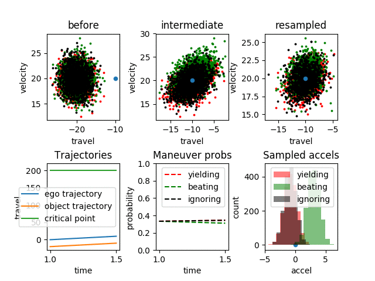

### Description

This repository implements a simplified version of [Interaction-Aware Probabilistic Behavior Prediction in Urban Environments](https://arxiv.org/pdf/1804.10467.pdf), with some tools for visualizing. There is an accompanying [Medium post](https://markmliu.medium.com/whats-under-the-hood-5c1d83986039) which gives a high-level overview of the paper and code.

### Instructions

on mac:
If Python.h not found: `export CPLUS_INCLUDE_PATH=/System/Library/Frameworks/Python.framework/Versions/2.7/include/python2.7/`

If 'numpy/arrayobject.h' not found: `CPLUS_INCLUDE_PATH=$CPLUS_INCLUDE_PATH:/System/Library/Frameworks/Python.framework/Versions/2.7/Extras/lib/python/numpy/core/include`

`g++ test_pf.cpp particle_filter.cpp types.cpp idm.cpp kinematics.cpp plotting.cpp -std=c++14 -I/usr/include/python2.7 -lpython2.7 -g`

To save output to a file:
`./a.out <particles_filename>`

Also potentially useful: https://stackoverflow.com/questions/21784641/installation-issue-with-matplotlib-python?noredirect=1&lq=1